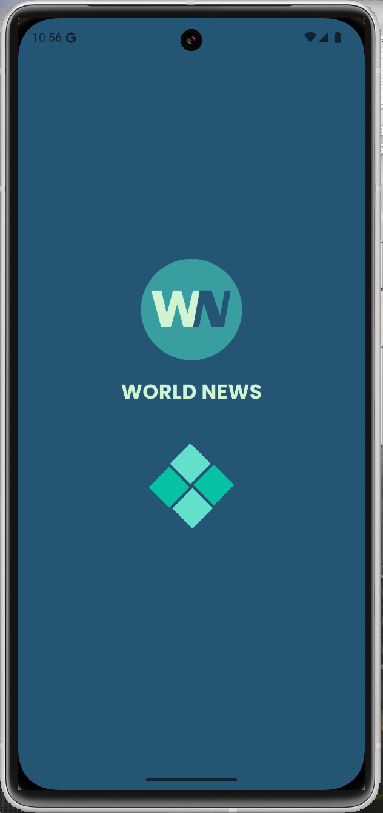
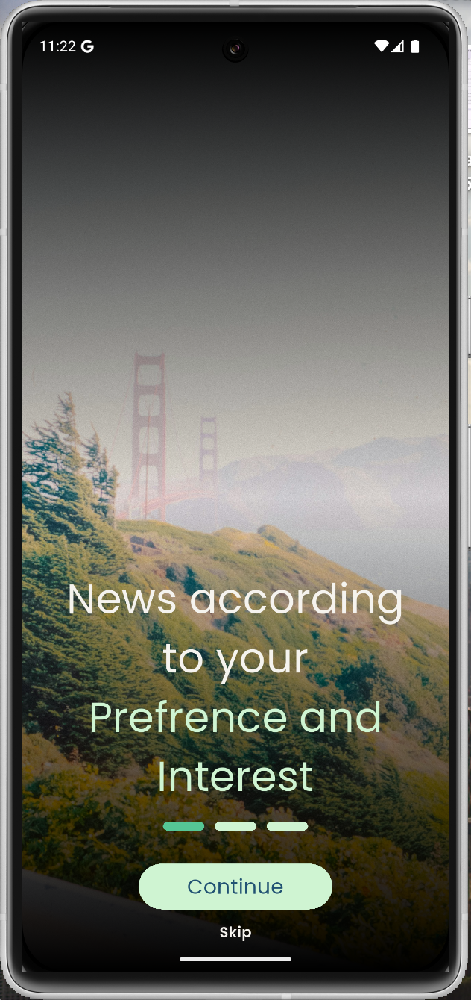
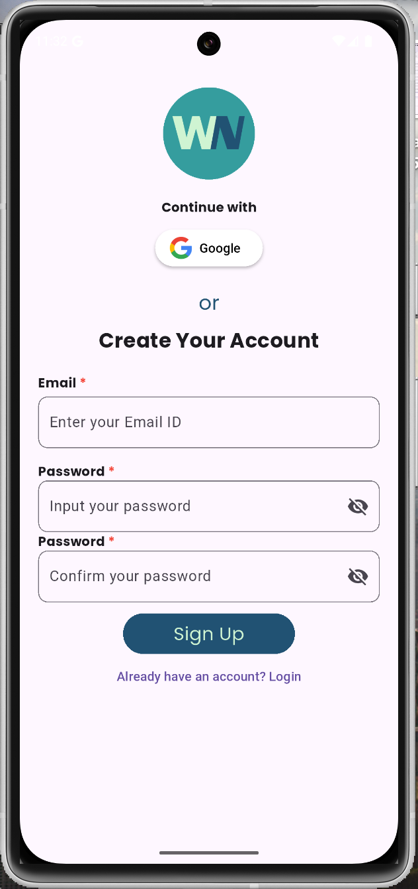
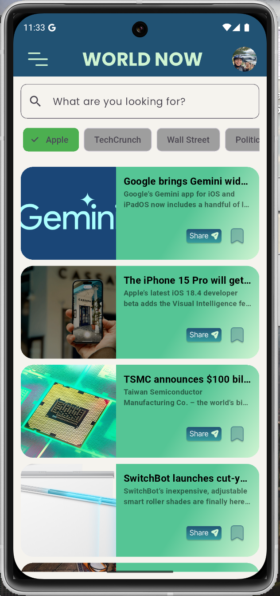
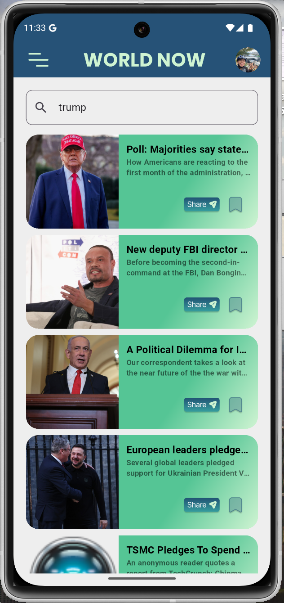
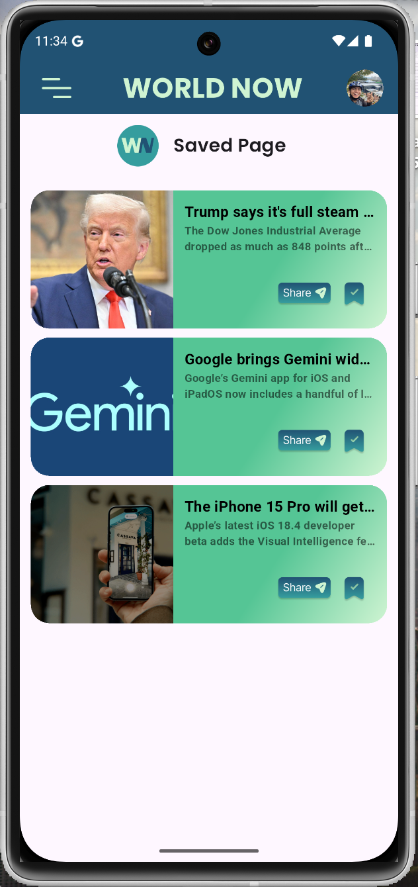

# News App - Flutter

## 📌 Deskripsi Proyek

Proyek ini merupakan bagian dari penyelesaian bootcamp Sanbercode Flutter. Aplikasi ini menampilkan berita dari API [NewsAPI.org](https://newsapi.org/) yang tersedia secara gratis.

Aplikasi ini dapat digunakan secara komersial, namun dengan keterbatasan API untuk pengguna gratis, yaitu hanya bisa mendapatkan headline dan deskripsi singkat dari berita.

## ✨ Fitur Aplikasi

- **Autentikasi Pengguna**
  - Register dan login dengan email & password menggunakan Firebase Authentication.
  - Login menggunakan akun Google untuk pengalaman yang lebih mudah dan cepat.
- **Penyimpanan Sesi**
  - Menggunakan `shared_preferences` untuk menyimpan sesi pengguna agar tidak perlu login kembali selama aplikasi tidak ditutup sepenuhnya.
- **Tampilan UI Menarik**

  - Desain UI terinspirasi dari Figma Community dengan lebih dari 1K likes.
  - [Lihat desain di Figma](<https://www.figma.com/design/d7XSnx51jr5nev8iaMT5Es/News-App-(World-News)-UI-Kit-(Community)?t=n33FUjcBYaNo5ptP-0>)

- **Kategori Berita**
  - Pengguna bisa mencari berita berdasarkan kategori yang disediakan oleh NewsAPI.org.
- **Pencarian Berita**
  - Pengguna bisa mencari berita tertentu melalui kotak pencarian yang disediakan.
- **Berbagi Berita**
  - Pengguna bisa membagikan berita ke berbagai platform lain seperti WhatsApp, Instagram, Facebook, dll.
- **Fitur Bookmark**
  - Pengguna bisa menyimpan berita untuk dibaca nanti.

## 🛠 Teknologi & Package yang Digunakan

Aplikasi ini menggunakan **State Management GetX** untuk manajemen status yang lebih efisien. Berikut adalah daftar dependencies yang digunakan dalam proyek ini:

```yaml
dependencies:
  flutter:
    sdk: flutter

  cupertino_icons: ^1.0.8
  google_fonts: ^6.2.1
  get: ^4.7.2

  firebase_core: ^3.12.0
  firebase_auth: ^5.5.0
  google_sign_in: ^6.2.2
  shared_preferences: ^2.5.2
  dio: ^5.8.0+1
  intl: ^0.20.2
  flutter_dotenv: ^5.2.1
  lottie: ^3.3.1
```

## Berikut Screenshot dari Aplikasi ini

1. Splashscreen(loading screen)
   

2. Onboarding Screen
   

   

   

3. Login Page
   

4. Sign Up Page
   

5. News Page
   

6. Search Page
   

7. Saved Page
   

8. Menu Page
   

9. Settings Page
   

## 📌 Cara Menjalankan Proyek

1. Clone repositori ini:
   ```sh
   git clone https://github.com/username/repository-name.git
   ```
2. Masuk ke direktori proyek:
   ```sh
   cd repository-name
   ```
3. Install dependencies:
   ```sh
   flutter pub get
   ```
4. Buat file `.env` dan masukkan API Key dari [NewsAPI.org](https://newsapi.org/) seperti berikut:
   ```env
   NEWS_API_KEY=your_api_key_here
   ```
5. Jalankan aplikasi:
   ```sh
   flutter run
   ```

## 🎯 Catatan

- Pastikan sudah memiliki akun Firebase dan mengkonfigurasi Firebase Authentication untuk Email/Password serta Google Sign-In.
- Gunakan `.env` untuk menyimpan API Key agar lebih aman.

## 📜 Lisensi

Proyek ini bersifat open-source dan bebas digunakan, namun pastikan untuk mematuhi aturan penggunaan dari [NewsAPI.org](https://newsapi.org/).

---

🚀 Selamat mencoba dan semoga bermanfaat!

## Getting Started

This project is a starting point for a Flutter application.

A few resources to get you started if this is your first Flutter project:

- [Lab: Write your first Flutter app](https://docs.flutter.dev/get-started/codelab)
- [Cookbook: Useful Flutter samples](https://docs.flutter.dev/cookbook)

For help getting started with Flutter development, view the
[online documentation](https://docs.flutter.dev/), which offers tutorials,
samples, guidance on mobile development, and a full API reference.
