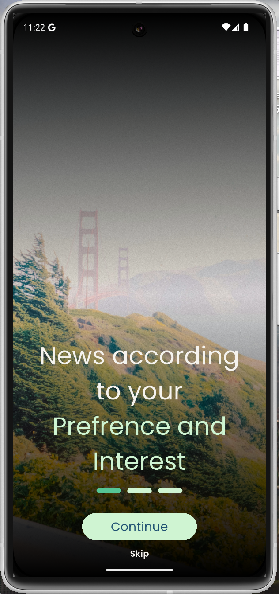
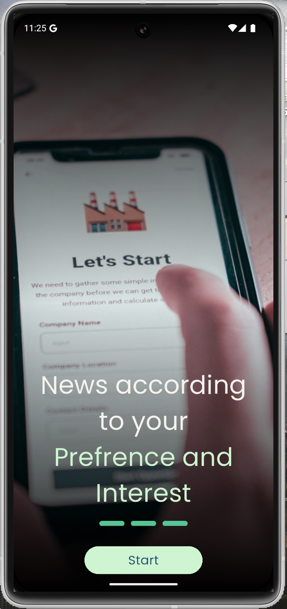
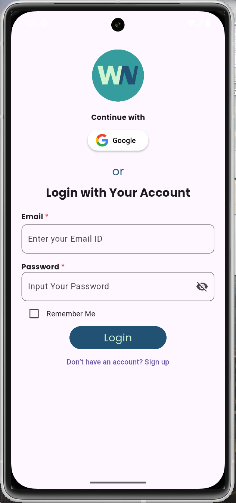
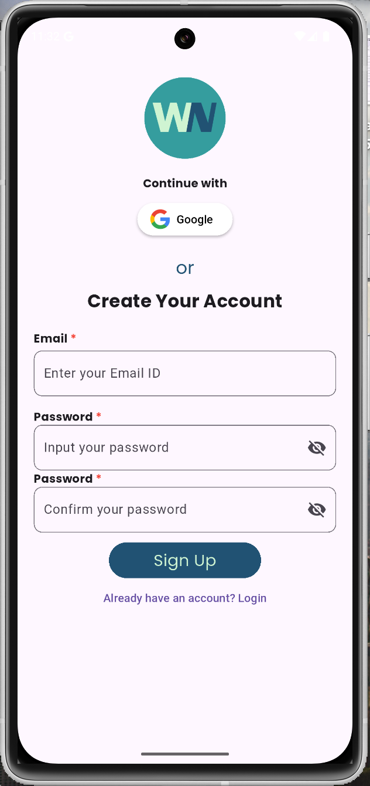
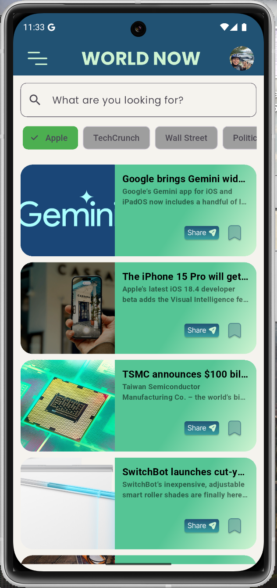
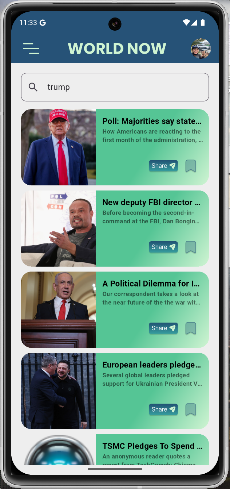
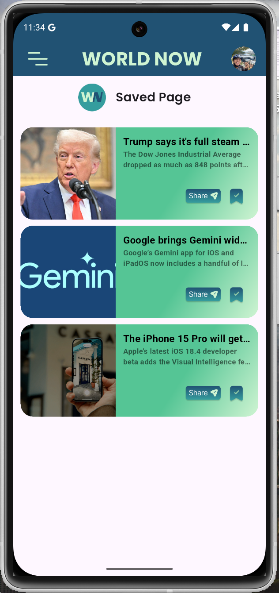
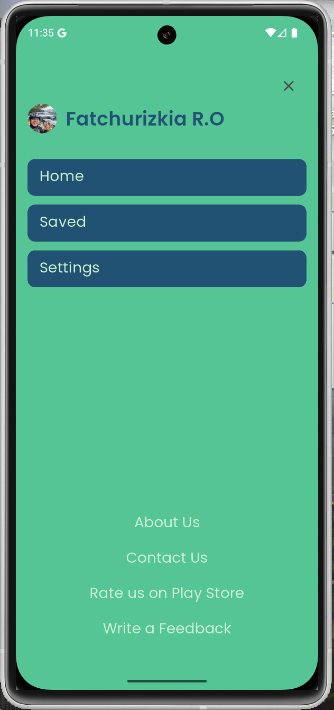
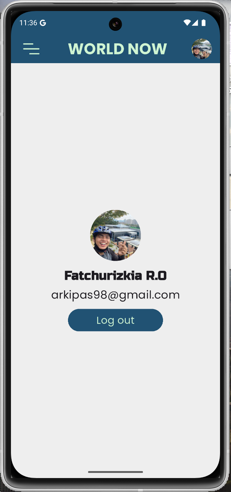
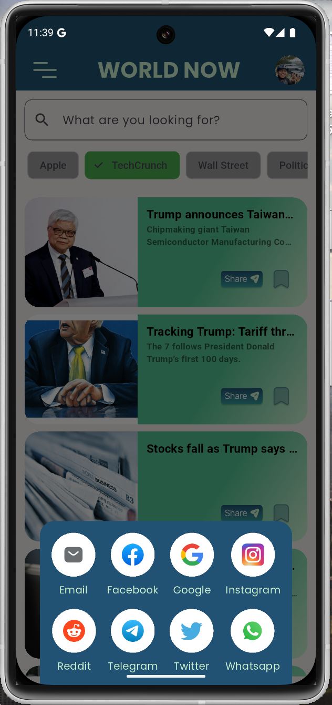

# News App - Flutter

## 📌 Deskripsi Proyek

Proyek ini merupakan bagian dari penyelesaian bootcamp Sanbercode Flutter. Aplikasi ini menampilkan berita dari API [NewsAPI.org](https://newsapi.org/) yang tersedia secara gratis.

Aplikasi ini dapat digunakan secara komersial, namun dengan keterbatasan API untuk pengguna gratis, yaitu hanya bisa mendapatkan headline dan deskripsi singkat dari berita.

## ✨ Fitur Aplikasi

- **Autentikasi Pengguna**
  - Register dan login dengan email & password menggunakan Firebase Authentication.
  - Login menggunakan akun Google untuk pengalaman yang lebih mudah dan cepat.
- **Penyimpanan Sesi**
  - Menggunakan `shared_preferences` untuk menyimpan sesi pengguna agar tidak perlu login kembali selama aplikasi tidak ditutup sepenuhnya.
- **Tampilan UI Menarik**

  - Desain UI terinspirasi dari Figma Community dengan lebih dari 1K likes.
  - [Lihat desain di Figma](<https://www.figma.com/design/d7XSnx51jr5nev8iaMT5Es/News-App-(World-News)-UI-Kit-(Community)?t=n33FUjcBYaNo5ptP-0>)

- **Kategori Berita**
  - Pengguna bisa mencari berita berdasarkan kategori yang disediakan oleh NewsAPI.org.
- **Pencarian Berita**
  - Pengguna bisa mencari berita tertentu melalui kotak pencarian yang disediakan.
- **Berbagi Berita**
  - Pengguna bisa membagikan berita ke berbagai platform lain seperti WhatsApp, Instagram, Facebook, dll.
- **Fitur Bookmark**
  - Pengguna bisa menyimpan berita untuk dibaca nanti.

## 🛠 Teknologi & Package yang Digunakan

Aplikasi ini menggunakan **State Management GetX** untuk manajemen status yang lebih efisien. Berikut adalah daftar dependencies yang digunakan dalam proyek ini:

```yaml
dependencies:
  flutter:
    sdk: flutter

  cupertino_icons: ^1.0.8
  google_fonts: ^6.2.1
  get: ^4.7.2
  url_launcher: ^6.3.1
  firebase_core: ^3.12.0
  firebase_auth: ^5.5.0
  google_sign_in: ^6.2.2
  get_storage: ^2.1.1
  image_picker: ^1.1.2
  shared_preferences: ^2.5.2
  dio: ^5.8.0+1
  intl: ^0.20.2
  flutter_dotenv: ^5.2.1
  lottie: ^3.3.1
```

## Berikut Screenshot dari Aplikasi ini

1. Splashscreen(loading screen)
   

2. Onboarding Screen
   




3. Login Page
   

4. Sign Up Page
   

5. News Page
   

6. Search Page
   

7. Saved Page
   

8. Menu Page
   

9. Settings Page
   

10. Share pop-up
    

11. Detail Page
    

12. Error Page
    

## 📌 Cara Menjalankan Proyek

1. Clone repositori ini:
   ```sh
   git clone https://github.com/username/repository-name.git
   ```
2. Masuk ke direktori proyek:
   ```sh
   cd repository-name
   ```
3. Install dependencies:
   ```sh
   flutter pub get
   ```
4. Buat file `.env` dan masukkan API Key dari [NewsAPI.org](https://newsapi.org/) seperti berikut:
   ```env
   NEWS_API_KEY=your_api_key_here
   ```
5. Jalankan aplikasi:
   ```sh
   flutter run
   ```

## 🎯 Catatan

- Pastikan sudah memiliki akun Firebase dan mengkonfigurasi Firebase Authentication untuk Email/Password serta Google Sign-In.
- Gunakan `.env` untuk menyimpan API Key agar lebih aman.

## 📜 Lisensi

Proyek ini bersifat open-source dan bebas digunakan, namun pastikan untuk mematuhi aturan penggunaan dari [NewsAPI.org](https://newsapi.org/).

---

🚀 Selamat mencoba dan semoga bermanfaat!

# News App - Flutter

## 📌 Project Description

This project is part of completing the Sanbercode Flutter bootcamp. The app displays news from the [NewsAPI.org](https://newsapi.org/) API, which is available for free.

This app can be used commercially, but with API limitations for free users, allowing only access to headlines and short descriptions of news articles.

## ✨ Features

- **User Authentication**
  - Register and log in with email & password using Firebase Authentication.
  - Log in with a Google account for a faster and easier experience.
- **Session Storage**
  - Uses `shared_preferences` to store user sessions, allowing users to stay logged in as long as the app is not fully closed.
- **Attractive UI Design**
  - UI design inspired by a Figma Community template with over 1K likes.
  - [View the design on Figma](<https://www.figma.com/design/d7XSnx51jr5nev8iaMT5Es/News-App-(World-News)-UI-Kit-(Community)?t=n33FUjcBYaNo5ptP-0>)
- **News Categories**
  - Users can browse news based on categories provided by NewsAPI.org.
- **News Search**
  - Users can search for specific news articles using the search bar.
- **Share News**
  - Users can share news articles to other platforms like WhatsApp, Instagram, Facebook, etc.
- **Bookmark Feature**
  - Users can save articles for later reading.

## 🛠 Technologies & Packages Used

This app uses **GetX State Management** for efficient state handling. Below are the dependencies used in this project:

```yaml
dependencies:
  flutter:
    sdk: flutter

  cupertino_icons: ^1.0.8
  google_fonts: ^6.2.1
  get: ^4.7.2

  firebase_core: ^3.12.0
  firebase_auth: ^5.5.0
  google_sign_in: ^6.2.2
  shared_preferences: ^2.5.2
  dio: ^5.8.0+1
  intl: ^0.20.2
  flutter_dotenv: ^5.2.1
  lottie: ^3.3.1
```

## 📌 How to Run the Project

1. Clone this repository:
   ```sh
   git clone https://github.com/username/repository-name.git
   ```
2. Navigate to the project directory:
   ```sh
   cd repository-name
   ```
3. Install dependencies:
   ```sh
   flutter pub get
   ```
4. Create a `.env` file and insert your API Key from [NewsAPI.org](https://newsapi.org/):
   ```env
   NEWS_API_KEY=your_api_key_here
   ```
5. Run the application:
   ```sh
   flutter run
   ```

## 🎯 Notes

- Make sure you have a Firebase account and configure Firebase Authentication for Email/Password and Google Sign-In.
- Use `.env` to store your API Key for better security.

## 📜 License

This project is open-source and free to use, but make sure to comply with the usage policies of [NewsAPI.org](https://newsapi.org/).

---

🚀 Happy coding and enjoy!

## Getting Started

This project is a starting point for a Flutter application.

A few resources to get you started if this is your first Flutter project:

- [Lab: Write your first Flutter app](https://docs.flutter.dev/get-started/codelab)
- [Cookbook: Useful Flutter samples](https://docs.flutter.dev/cookbook)

For help getting started with Flutter development, view the
[online documentation](https://docs.flutter.dev/), which offers tutorials,
samples, guidance on mobile development, and a full API reference.
